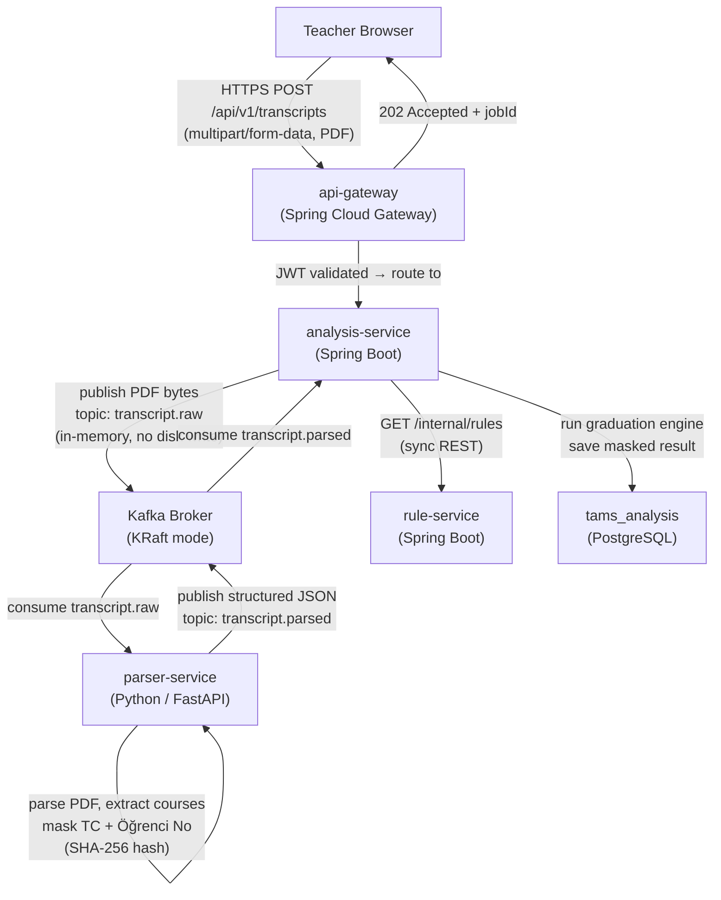
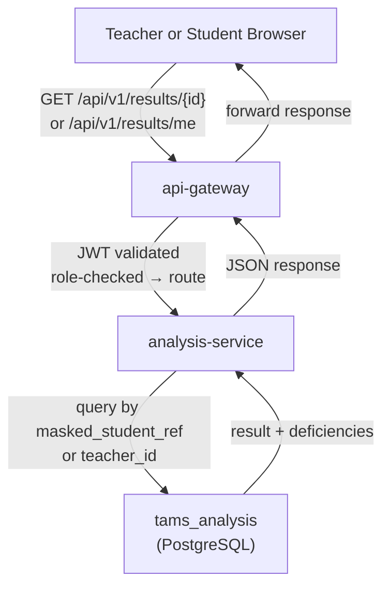
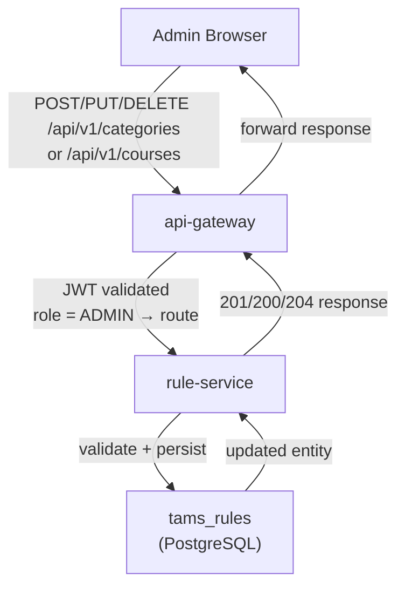

# TAMS — Architecture Document

**Transkript Analiz ve Mezuniyet Kontrol Sistemi**

---

## Table of Contents

1. [System Overview](#1-system-overview)
2. [Microservice Map](#2-microservice-map)
3. [Repository Structure](#3-repository-structure)
4. [Data Flow Diagrams](#4-data-flow-diagrams)
5. [Database Schemas](#5-database-schemas)
6. [Inter-Service Communication Strategy](#6-inter-service-communication-strategy)
7. [Security & PII Protection](#7-security--pii-protection)
8. [Kubernetes Deployment & Scaling Strategy](#8-kubernetes-deployment--scaling-strategy)

---

## 1. System Overview

TAMS is a web-based, microservices-driven system that allows university teachers to upload student PDF transcripts, automatically parse them, compare the extracted course data against admin-defined graduation rules, and instantly produce a graduation eligibility report — all without permanently storing any personally identifiable information (PII) on disk.

**Core user roles:**

| Role    | Primary Capability                                                                 |
|---------|------------------------------------------------------------------------------------|
| Admin   | Define, update, delete, and view graduation rule sets (categories, courses, credits, ECTS) |
| Teacher | Upload student PDF transcripts, trigger analysis, view results and history          |
| Student | View their own analysis result (read-only) if a teacher has uploaded their transcript |

---

## 2. Microservice Map

The system is composed of **5 backend microservices** and **1 frontend application**, all containerized with Docker and orchestrated by Kubernetes.

```
┌─────────────────────────────────────────────────────────────────┐
│                         TAMS Platform                           │
│                                                                 │
│  ┌──────────┐    ┌──────────────┐    ┌────────────────────┐    │
│  │ frontend │    │ api-gateway  │    │   auth-service     │    │
│  │  (React) │───▶│(Spring Cloud │───▶│  (Spring Boot)     │    │
│  └──────────┘    │  Gateway)   │    └────────────────────┘    │
│                  └──────┬───────┘                              │
│                         │                                      │
│            ┌────────────┼─────────────┐                        │
│            ▼            ▼             ▼                        │
│  ┌──────────────┐  ┌──────────┐  ┌──────────────────────┐    │
│  │ rule-service │  │  Kafka   │  │  analysis-service    │    │
│  │(Spring Boot) │  │ (KRaft)  │  │  (Spring Boot)       │    │
│  └──────────────┘  └────┬─────┘  └──────────────────────┘    │
│                         │                                      │
│                         ▼                                      │
│                  ┌──────────────┐                              │
│                  │parser-service│                              │
│                  │  (Python /   │                              │
│                  │  FastAPI)    │                              │
│                  └──────────────┘                              │
└─────────────────────────────────────────────────────────────────┘
```

### 2.1 api-gateway

- **Technology:** Spring Cloud Gateway (Spring Boot)
- **Responsibilities:**
  - Single entry point for all client requests
  - JWT token validation on every inbound request (delegates verification to auth-service or validates locally with shared secret)
  - Route forwarding to downstream services based on path prefix
  - Rate limiting to protect against request floods during graduation periods
  - CORS policy enforcement
- **Does NOT contain business logic**

### 2.2 auth-service

- **Technology:** Spring Boot, Spring Security, JWT (JJWT library), PostgreSQL
- **Responsibilities:**
  - User registration and login
  - JWT access token issuance and refresh token rotation
  - Role-based authorization metadata (`ADMIN`, `TEACHER`, `STUDENT`)
  - Teacher-to-student relationship management (which teacher uploaded which student)
- **Database:** `tams_auth` (PostgreSQL)

### 2.3 rule-service

- **Technology:** Spring Boot, Spring Data JPA, PostgreSQL
- **Responsibilities:**
  - Full CRUD for graduation rule categories (e.g., Out-of-Department Mandatory, In-Department Mandatory, Technical Elective, Non-Technical Elective)
  - Full CRUD for individual courses within each category (course code, credit, ECTS)
  - Accessible only by users with the `ADMIN` role (for writes); read endpoints accessible by `analysis-service` internally
- **Database:** `tams_rules` (PostgreSQL)

### 2.4 parser-service

- **Technology:** Python, FastAPI, pdfplumber (primary), PyPDF2 (fallback), confluent-kafka
- **Responsibilities:**
  - Consumes PDF bytes from Kafka topic `transcript.raw`
  - Parses transcript entirely in memory — **never writes PDF to disk**
  - Extracts course list (code, name, credits, grade, semester)
  - Detects and masks/replaces PII fields (TC Kimlik No, Öğrenci No) with a deterministic SHA-256 hash before publishing
  - Publishes structured, PII-free course data to Kafka topic `transcript.parsed`
- **Database:** None — stateless by design
- **Scaling note:** This is the most CPU-intensive service during peak load; it is a primary HPA target

### 2.5 analysis-service

- **Technology:** Spring Boot, Spring Kafka, Spring Data JPA, PostgreSQL, RestTemplate / WebClient
- **Responsibilities:**
  - Receives PDF upload requests from api-gateway; publishes PDF bytes to `transcript.raw` Kafka topic
  - Consumes parsed course data from `transcript.parsed` Kafka topic
  - Fetches the current active graduation rule set from rule-service via REST
  - Runs the graduation eligibility engine (credit matching, ECTS matching, required course checking per category)
  - Persists masked analysis results and deficiency details to its own database
  - Exposes result query endpoints for Teacher history view and Student self-view
- **Database:** `tams_analysis` (PostgreSQL)

### 2.6 frontend

- **Technology:** React (Vite), React Router, Axios, Tailwind CSS
- **Responsibilities:**
  - Role-aware routing: Admin dashboard, Teacher dashboard, Student result view
  - Admin: Category and course management tables with add/edit/delete modals
  - Teacher: PDF file upload interface, analysis result display, searchable student history
  - Student: Read-only personal result page (fully responsive / mobile-first)
- **Deployment:** nginx container serving the static build

---

## 3. Repository Structure

The project uses a **monorepo** layout. All services and the frontend live in a single repository under `services/` and `frontend/` respectively, with shared infrastructure configurations at the root. The four Java services are managed as a **Maven multi-module build** so the entire backend can be opened as a single project in IntelliJ IDEA Ultimate.

```
tams/
├── pom.xml                          ← Maven Parent POM (packaging: pom)
├── docs/
│   ├── architecture.md              ← this file
│   └── todo.md
├── .cursorrules
├── services/
│   ├── api-gateway/
│   │   └── pom.xml                  ← inherits root parent
│   ├── auth-service/
│   │   └── pom.xml                  ← inherits root parent
│   ├── rule-service/
│   │   └── pom.xml                  ← inherits root parent
│   ├── parser-service/              ← Python / FastAPI; no pom.xml
│   │   ├── src/
│   │   │   ├── main.py
│   │   │   ├── consumer.py
│   │   │   ├── producer.py
│   │   │   ├── parser/
│   │   │   └── pii/
│   │   ├── tests/
│   │   ├── requirements.txt
│   │   ├── Dockerfile
│   │   └── .env.example
│   └── analysis-service/
│       └── pom.xml                  ← inherits root parent
├── frontend/                        ← React / Vite / TypeScript; no pom.xml
├── infrastructure/
│   ├── docker-compose.yml           ← local development environment
│   ├── docker-compose.infra.yml     ← Kafka + PostgreSQL only
│   └── k8s/
│       ├── namespace.yaml
│       ├── api-gateway/
│       ├── auth-service/
│       ├── rule-service/
│       ├── parser-service/
│       ├── analysis-service/
│       ├── frontend/
│       ├── kafka/
│       ├── cert-manager/
│       └── postgres/
└── README.md
```

### 3.1 Maven Multi-Module Build & IntelliJ IDEA Setup

#### Root `pom.xml` (parent POM)

The root `pom.xml` sits at `tams/` and does three things: it inherits Spring Boot's dependency management via `spring-boot-starter-parent`, it declares all four Java services as `<modules>`, and it centralises shared dependency versions in `<properties>` so child POMs never specify version numbers themselves.

```xml
<?xml version="1.0" encoding="UTF-8"?>
<project xmlns="http://maven.apache.org/POM/4.0.0"
         xmlns:xsi="http://www.w3.org/2001/XMLSchema-instance"
         xsi:schemaLocation="http://maven.apache.org/POM/4.0.0 https://maven.apache.org/xsd/maven-4.0.0.xsd">
    <modelVersion>4.0.0</modelVersion>

    <parent>
        <groupId>org.springframework.boot</groupId>
        <artifactId>spring-boot-starter-parent</artifactId>
        <version>3.3.5</version>
        <relativePath/>
    </parent>

    <groupId>com.tams</groupId>
    <artifactId>tams</artifactId>
    <version>0.0.1-SNAPSHOT</version>
    <packaging>pom</packaging>

    <modules>
        <module>services/api-gateway</module>
        <module>services/auth-service</module>
        <module>services/rule-service</module>
        <module>services/analysis-service</module>
    </modules>

    <properties>
        <java.version>21</java.version>
        <spring-cloud.version>2023.0.3</spring-cloud.version>
        <jjwt.version>0.12.6</jjwt.version>
        <springdoc.version>2.6.0</springdoc.version>
    </properties>

    <dependencyManagement>
        <dependencies>
            <!-- Spring Cloud BOM (required by api-gateway) -->
            <dependency>
                <groupId>org.springframework.cloud</groupId>
                <artifactId>spring-cloud-dependencies</artifactId>
                <version>${spring-cloud.version}</version>
                <type>pom</type>
                <scope>import</scope>
            </dependency>
        </dependencies>
    </dependencyManagement>
</project>
```

#### Child `pom.xml` (each Java service)

Each service generated via Spring Initializr ships with `<parent>` pointing directly to `spring-boot-starter-parent`. This must be replaced with a reference to the root parent:

```xml
<parent>
    <groupId>com.tams</groupId>
    <artifactId>tams</artifactId>
    <version>0.0.1-SNAPSHOT</version>
    <relativePath>../../pom.xml</relativePath>
</parent>
```

Dependency versions defined in the root `<properties>` are then usable in child POMs without a `<version>` tag:

```xml
<!-- In services/auth-service/pom.xml — no version needed here -->
<dependency>
    <groupId>io.jsonwebtoken</groupId>
    <artifactId>jjwt-api</artifactId>
    <!-- version inherited from root pom.xml ${jjwt.version} -->
</dependency>
```

#### Opening the project in IntelliJ IDEA Ultimate

1. `File → Open` — select the root `tams/` folder (not a sub-folder)
2. IntelliJ detects the root `pom.xml` and prompts to import as a Maven project — click **Trust Project**
3. All four Java service modules appear in the **Maven** side panel (`View → Tool Windows → Maven`)
4. Each module has its own Spring Boot run configuration auto-generated under **Run → Edit Configurations**
5. `Reload All Maven Projects` (Maven panel toolbar) whenever `pom.xml` files are edited

#### Python parser-service in IntelliJ IDEA Ultimate

IntelliJ IDEA Ultimate includes a bundled Python plugin. Once the project is open:

1. Create a virtual environment inside the service folder: `python -m venv services/parser-service/.venv`
2. `File → Project Structure → SDKs → +` — add the `.venv/bin/python` interpreter
3. Right-click `services/parser-service/src/` → **Mark Directory As → Sources Root**
4. IntelliJ will resolve imports and offer code completion for all packages in `requirements.txt`

#### React frontend in IntelliJ IDEA Ultimate

IntelliJ IDEA Ultimate includes a bundled Node.js plugin:

1. `frontend/` is auto-detected as a Node.js project when `package.json` is present
2. Run `npm install` from the built-in terminal to restore packages
3. The Vite dev server can be started directly from the **npm** side panel (`View → Tool Windows → npm`)

---

## 4. Data Flow Diagrams

### 4.1 Transcript Upload & Analysis Flow



### 4.2 Result Retrieval Flow



### 4.3 Admin Rule Management Flow



### 4.4 PII Masking Detail

```
Raw PDF Content (in Kafka message, never on disk):
  TC Kimlik No : 12345678901
  Öğrenci No  : 2210356789

               ↓ parser-service processes in memory

Published to transcript.parsed (Kafka):
  student_ref  : "sha256:a3f1c9..."   ← deterministic hash of original TC+StudentNo
  courses      : [ { code, name, credit, ects, grade, semester }, ... ]
  (TC and Öğrenci No fields are permanently absent from all downstream data)
```

---

## 5. Database Schemas

### 5.1 auth-service → `tams_auth`

```sql
CREATE TABLE users (
    id            UUID PRIMARY KEY DEFAULT gen_random_uuid(),
    username      VARCHAR(100) NOT NULL UNIQUE,
    email         VARCHAR(255) NOT NULL UNIQUE,
    password_hash VARCHAR(255) NOT NULL,
    role          VARCHAR(20)  NOT NULL CHECK (role IN ('ADMIN', 'TEACHER', 'STUDENT')),
    is_active     BOOLEAN      NOT NULL DEFAULT TRUE,
    created_at    TIMESTAMPTZ  NOT NULL DEFAULT NOW(),
    updated_at    TIMESTAMPTZ  NOT NULL DEFAULT NOW()
);

-- Links a student account to the teacher who uploaded their transcript.
-- A student can only log in and see results if a row exists here.
CREATE TABLE teacher_student_map (
    teacher_id  UUID NOT NULL REFERENCES users(id) ON DELETE CASCADE,
    student_id  UUID NOT NULL REFERENCES users(id) ON DELETE CASCADE,
    created_at  TIMESTAMPTZ NOT NULL DEFAULT NOW(),
    PRIMARY KEY (teacher_id, student_id)
);
```

### 5.2 rule-service → `tams_rules`

```sql
-- Top-level graduation requirement group
-- e.g. "Out-of-Department Mandatory", "Technical Elective Group A"
CREATE TABLE categories (
    id          UUID PRIMARY KEY DEFAULT gen_random_uuid(),
    name        VARCHAR(255) NOT NULL UNIQUE,
    description TEXT,
    min_credit  NUMERIC(5,2) NOT NULL DEFAULT 0,
    min_ects    NUMERIC(5,2) NOT NULL DEFAULT 0,
    created_at  TIMESTAMPTZ  NOT NULL DEFAULT NOW(),
    updated_at  TIMESTAMPTZ  NOT NULL DEFAULT NOW()
);

-- Individual courses that belong to a category
CREATE TABLE courses (
    id           UUID PRIMARY KEY DEFAULT gen_random_uuid(),
    category_id  UUID         NOT NULL REFERENCES categories(id) ON DELETE CASCADE,
    course_code  VARCHAR(20)  NOT NULL,
    course_name  VARCHAR(255) NOT NULL,
    credit       NUMERIC(4,2) NOT NULL,
    ects         NUMERIC(4,2) NOT NULL,
    is_mandatory BOOLEAN      NOT NULL DEFAULT FALSE,
    created_at   TIMESTAMPTZ  NOT NULL DEFAULT NOW(),
    updated_at   TIMESTAMPTZ  NOT NULL DEFAULT NOW(),
    UNIQUE (category_id, course_code)
);
```

### 5.3 analysis-service → `tams_analysis`

```sql
-- One row per analysis run
CREATE TABLE analysis_results (
    id                  UUID PRIMARY KEY DEFAULT gen_random_uuid(),
    masked_student_ref  VARCHAR(80)  NOT NULL,   -- SHA-256 hash from parser-service
    teacher_id          UUID         NOT NULL,   -- ID from auth-service
    is_eligible         BOOLEAN      NOT NULL,
    total_credit        NUMERIC(6,2) NOT NULL DEFAULT 0,
    total_ects          NUMERIC(6,2) NOT NULL DEFAULT 0,
    created_at          TIMESTAMPTZ  NOT NULL DEFAULT NOW()
);

-- One row per unfulfilled requirement category
CREATE TABLE deficiencies (
    id                  UUID PRIMARY KEY DEFAULT gen_random_uuid(),
    result_id           UUID         NOT NULL REFERENCES analysis_results(id) ON DELETE CASCADE,
    category_name       VARCHAR(255) NOT NULL,
    required_credit     NUMERIC(5,2) NOT NULL,
    earned_credit       NUMERIC(5,2) NOT NULL,
    required_ects       NUMERIC(5,2) NOT NULL,
    earned_ects         NUMERIC(5,2) NOT NULL,
    missing_courses     TEXT[]                  -- array of course codes not yet passed
);

-- Snapshot of each course found in the transcript (masked, no PII)
CREATE TABLE transcript_courses (
    id                  UUID PRIMARY KEY DEFAULT gen_random_uuid(),
    result_id           UUID         NOT NULL REFERENCES analysis_results(id) ON DELETE CASCADE,
    course_code         VARCHAR(20)  NOT NULL,
    course_name         VARCHAR(255) NOT NULL,
    credit              NUMERIC(4,2) NOT NULL,
    ects                NUMERIC(4,2) NOT NULL,
    grade               VARCHAR(5),
    semester            VARCHAR(20),
    is_passed           BOOLEAN      NOT NULL DEFAULT FALSE
);
```

---

## 6. Inter-Service Communication Strategy

### 6.1 Synchronous (REST over HTTP)

| Caller               | Callee        | Endpoint                      | Purpose                              |
|----------------------|---------------|-------------------------------|--------------------------------------|
| Client browser       | api-gateway   | All `/api/v1/*`               | All user-facing operations           |
| api-gateway          | auth-service  | `POST /internal/auth/validate`| Token introspection / user info      |
| api-gateway          | rule-service  | `/api/v1/categories`, `/api/v1/courses` | Admin CRUD, proxied      |
| api-gateway          | analysis-service | `/api/v1/transcripts`, `/api/v1/results` | Upload + result query |
| analysis-service     | rule-service  | `GET /internal/rules`         | Fetch full rule set before comparison|

Internal endpoints (prefixed `/internal/`) are **not** exposed through the api-gateway and are only reachable within the Kubernetes cluster network via `ClusterIP` services.

### 6.2 Asynchronous (Apache Kafka — KRaft mode)

| Topic                | Producer              | Consumer              | Payload                                      |
|----------------------|-----------------------|-----------------------|----------------------------------------------|
| `transcript.raw`     | analysis-service      | parser-service        | PDF bytes (Base64-encoded), jobId, teacherId |
| `transcript.parsed`  | parser-service        | analysis-service      | Masked JSON: student_ref, courses[], jobId   |

**Why Kafka for the upload pipeline:**
- Decouples the slow PDF parsing step from the HTTP request/response cycle
- Parser replicas can scale independently; consumers form a consumer group
- PDF bytes are held only in Kafka's in-memory buffer (no `log.dirs` persistence for this topic in production config, or use `cleanup.policy=delete` with a very short retention of 5 minutes)

### 6.3 Service Discovery

Inside Kubernetes, services call each other using DNS names:
`http://rule-service.tams.svc.cluster.local:8080`

For local development (Docker Compose), services use the container name as hostname.

---

## 7. Security & PII Protection

### 7.1 Authentication & Authorization

- All requests must carry a `Bearer` JWT in the `Authorization` header.
- The api-gateway validates the JWT signature and expiry before routing any request.
- Role claims embedded in the JWT (`ADMIN`, `TEACHER`, `STUDENT`) are used by each service to enforce method-level authorization (`@PreAuthorize` in Spring Security).
- JWT secrets are stored in Kubernetes `Secret` objects and injected as environment variables — never hardcoded.

### 7.2 PII Masking Protocol

1. The PDF is passed as bytes through the Kafka `transcript.raw` topic. The message is ephemeral (short retention TTL, no disk flush guarantee for this topic).
2. Inside parser-service, a dedicated `pii_masker` module is the **only** place that ever sees raw TC Kimlik No and Öğrenci No.
3. Before any data is published back to Kafka, the masker replaces those fields with `sha256(salt + raw_value)`. The salt is an application-level secret (not stored in the DB).
4. No raw PII ever reaches analysis-service, rule-service, or the database.
5. The PDF itself is never serialized to any file system at any point in the pipeline.

### 7.3 Transport Security

| Environment             | External Traffic                                                                 | Internal Traffic                    | Database Connections        |
|-------------------------|----------------------------------------------------------------------------------|-------------------------------------|-----------------------------|
| Local (Docker Compose)  | Plain HTTP (port 80)                                                             | Plain HTTP                          | No SSL required             |
| Production (Kubernetes) | HTTPS only — HTTP requests are force-redirected to HTTPS via Ingress (301)       | Plain HTTP within cluster network   | SSL mode `require`          |

Production HTTPS is terminated at the Kubernetes nginx Ingress controller. TLS certificates are issued and auto-renewed by cert-manager against the Let's Encrypt ACME endpoint (no manual renewal needed; cert-manager renews 30 days before expiry).

The local Docker Compose environment intentionally omits TLS to keep developer setup simple. Never expose the Docker Compose stack directly to the public internet.

---

## 8. Kubernetes Deployment & Scaling Strategy

### 8.1 Cluster Layout

```
Namespace: tams

Deployments (one per service):
  api-gateway          → 2 replicas (min), HPA max 5
  auth-service         → 2 replicas (min), HPA max 4
  rule-service         → 1 replica  (min), HPA max 3
  parser-service       → 2 replicas (min), HPA max 10  ← CPU-bound, primary scale target
  analysis-service     → 2 replicas (min), HPA max 8   ← also scaled for graduation traffic
  frontend             → 2 replicas (min), HPA max 5

StatefulSets:
  kafka                → 1 pod (MVP), expand to 3 for production
  postgres-auth        → 1 pod + PVC
  postgres-rules       → 1 pod + PVC
  postgres-analysis    → 1 pod + PVC
```

### 8.2 Horizontal Pod Autoscaler (HPA) Configuration

```yaml
# Example: parser-service HPA
apiVersion: autoscaling/v2
kind: HorizontalPodAutoscaler
metadata:
  name: parser-service-hpa
  namespace: tams
spec:
  scaleTargetRef:
    apiVersion: apps/v1
    kind: Deployment
    name: parser-service
  minReplicas: 2
  maxReplicas: 10
  metrics:
    - type: Resource
      resource:
        name: cpu
        target:
          type: Utilization
          averageUtilization: 60
    - type: Resource
      resource:
        name: memory
        target:
          type: Utilization
          averageUtilization: 70
```

The CPU threshold is set conservatively at 60% to give the autoscaler time to spin up new pods **before** the queue backs up, which is critical during sudden graduation-week spikes.

### 8.3 Resource Requests & Limits (per pod)

| Service           | CPU Request | CPU Limit | Memory Request | Memory Limit |
|-------------------|-------------|-----------|----------------|--------------|
| api-gateway       | 250m        | 500m      | 256Mi          | 512Mi        |
| auth-service      | 250m        | 500m      | 256Mi          | 512Mi        |
| rule-service      | 100m        | 300m      | 128Mi          | 256Mi        |
| parser-service    | 500m        | 1000m     | 512Mi          | 1Gi          |
| analysis-service  | 250m        | 750m      | 256Mi          | 512Mi        |
| frontend          | 50m         | 100m      | 64Mi           | 128Mi        |

### 8.4 Ingress

```yaml
apiVersion: networking.k8s.io/v1
kind: Ingress
metadata:
  name: tams-ingress
  namespace: tams
  annotations:
    cert-manager.io/cluster-issuer: "letsencrypt-prod"
    nginx.ingress.kubernetes.io/ssl-redirect: "true"
    nginx.ingress.kubernetes.io/force-ssl-redirect: "true"
    nginx.ingress.kubernetes.io/proxy-body-size: "10m"   # allow PDF uploads up to 10 MB
spec:
  tls:
    - hosts: [tams.example.com]
      secretName: tams-tls
  rules:
    - host: tams.example.com
      http:
        paths:
          - path: /api
            pathType: Prefix
            backend:
              service:
                name: api-gateway
                port:
                  number: 8080
          - path: /
            pathType: Prefix
            backend:
              service:
                name: frontend
                port:
                  number: 80
```

### 8.5 Kafka Topic Configuration for PII Safety

```properties
# transcript.raw — short-lived, no persistence to disk
transcript.raw.retention.ms=300000       # 5 minutes
transcript.raw.cleanup.policy=delete
transcript.raw.min.insync.replicas=1

# transcript.parsed — slightly longer for retry resilience
transcript.parsed.retention.ms=3600000  # 1 hour
transcript.parsed.cleanup.policy=delete
```

### 8.6 ConfigMaps and Secrets Structure

```
ConfigMaps:
  tams-config          → LOG_LEVEL, KAFKA_BROKER, SERVICE_URLS

Secrets:
  tams-jwt-secret      → JWT_SECRET
  tams-db-auth         → POSTGRES_URL, POSTGRES_USER, POSTGRES_PASSWORD (auth-service)
  tams-db-rules        → POSTGRES_URL, POSTGRES_USER, POSTGRES_PASSWORD (rule-service)
  tams-db-analysis     → POSTGRES_URL, POSTGRES_USER, POSTGRES_PASSWORD (analysis-service)
  tams-pii-salt        → PII_HASH_SALT (consumed only by parser-service)
```

---

*Document version: 1.0 — TAMS MVP*
