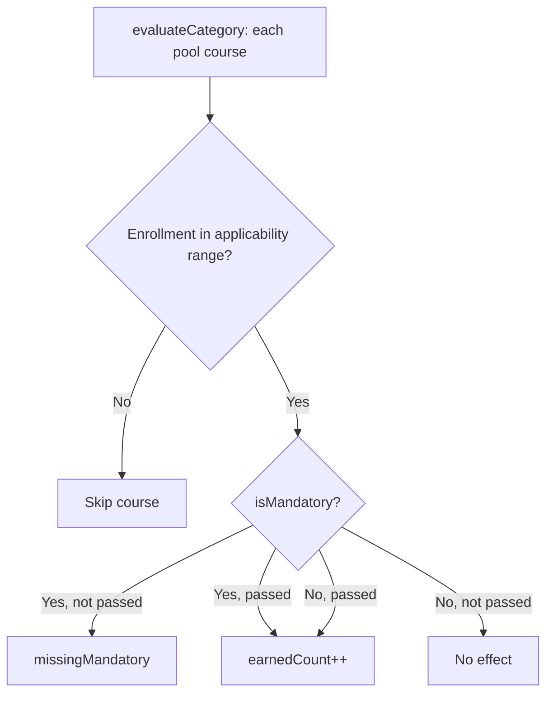

# Category-Course Cohort Bounds (Year + Term)

This document records the design, implementation plan, and delivered changes for **enrollment cohort boundaries on category-course assignments**. It complements [`graduation-rules-v2-architecture.md`](graduation-rules-v2-architecture.md) (Faz 3) with term-level granularity and unified applicability semantics.

---

## 1. Motivation

Graduation rules at Hacettepe BBM require that the same course code behave differently depending on when the student enrolled:

| Course | Role | Cohort rule |
|--------|------|-------------|
| BBM487 | Technical elective lab (pool) | Valid only for enrollments **before** 2017 Fall |
| BBM384 | Mandatory semester course | Mandatory only for enrollments **from** 2017 Fall |

Previously, `category_courses` had year-only `mandatory_from_year` / `mandatory_to_year`, which:

- Conflated “mandatory validity” with “category applicability”
- Could not express Güz/Bahar boundaries within the same calendar year
- Was not editable from the admin UI

The new model treats bounds as **when a course assignment applies in a category**, independent of the `isMandatory` flag.

---

## 2. Target Behaviour

Each category-course assignment has four optional boundary fields:

| Field | Meaning |
|-------|---------|
| **Start year + term** (`appliesFrom*`) | Assignment is **valid** for this cohort and **later** (inclusive lower bound) |
| **End year + term** (`appliesTo*`) | Assignment is **invalid** for this cohort and **later** (exclusive upper bound) |

`isMandatory` only matters when the student's enrollment cohort falls inside the applicability window:

| State | Mandatory | Passed | Effect |
|-------|-----------|--------|--------|
| In range | Yes | No | Missing mandatory course |
| In range | Yes | Yes | Counts toward thresholds |
| In range | No | Yes | Counts toward thresholds |
| In range | No | No | No effect |
| Out of range | — | — | **Ignored entirely** (no count, no requirement) |

### End-boundary semantics (confirmed)

**Exclusive end:** BBM487 with end `2017 GUZ` means students enrolled in **2017 Fall or later** do not get credit from that pool entry. Students enrolled in **2017 Spring** (February registration, same calendar year) remain eligible.

### Engine flow



Category-level cohort bounds (`categories.applies_from_year` / `applies_to_year`, year-only) still apply **in addition** to per-course bounds: a category can be skipped entirely for a cohort before per-course logic runs.

---

## 3. Cohort Comparison Rules

**Enrollment cohort** is derived from transcript `metadata.registration_date` (`DD.MM.YYYY`):

- **Year:** calendar year of the registration date
- **Term:** months 09–12 → `GUZ`; months 01–08 → `BAHAR`

**Ordering** (same calendar year): `BAHAR` (0) < `GUZ` (1) — spring intake precedes fall intake.

**Null term** in stored bounds defaults to `GUZ` at evaluation time.

**Missing registration date:** all applicability bounds are **ignored**; every pool course is evaluated (legacy safe default when cohort is unknown).

Implementation: [`EnrollmentCohortComparator.java`](../services/analysis-service/src/main/java/tr/com/hacettepe/tams/analysis_service/service/EnrollmentCohortComparator.java)

---

## 4. Data Model (rule-service)

### Migration

[`V14__add_term_bounds_to_category_courses.sql`](../services/rule-service/src/main/resources/db/migration/V14__add_term_bounds_to_category_courses.sql):

```sql
ALTER TABLE category_courses
    RENAME COLUMN mandatory_from_year TO applies_from_year;
ALTER TABLE category_courses
    RENAME COLUMN mandatory_to_year   TO applies_to_year;
ALTER TABLE category_courses
    ADD COLUMN applies_from_term VARCHAR(10),  -- GUZ | BAHAR
    ADD COLUMN applies_to_term   VARCHAR(10);
```

### Entity

[`CategoryCourse.java`](../services/rule-service/src/main/java/tr/com/hacettepe/tams/rule_service/domain/CategoryCourse.java):

| Column | Type | Notes |
|--------|------|-------|
| `is_mandatory` | boolean | Required when cohort is in range |
| `applies_from_year` | INTEGER | Inclusive lower bound; null = none |
| `applies_from_term` | VARCHAR(10) | GUZ or BAHAR |
| `applies_to_year` | INTEGER | Exclusive upper bound; null = none |
| `applies_to_term` | VARCHAR(10) | GUZ or BAHAR |

**Breaking rename:** API fields changed from `mandatoryFromYear` / `mandatoryToYear` to `appliesFromYear/Term` and `appliesToYear/Term`.

---

## 5. rule-service API

### Endpoints

| Method | Path | Purpose |
|--------|------|---------|
| `POST` | `/api/v1/categories/{catId}/courses` | Add course with bounds |
| `PUT` | `/api/v1/categories/{catId}/courses/{courseId}` | Update mandatory flag and bounds |
| `GET` | `/api/v1/categories/{catId}/courses` | List assignments including bounds |

### DTOs

- [`CategoryCourseRequest.java`](../services/rule-service/src/main/java/tr/com/hacettepe/tams/rule_service/dto/CategoryCourseRequest.java) — add
- [`UpdateCategoryCourseRequest.java`](../services/rule-service/src/main/java/tr/com/hacettepe/tams/rule_service/dto/UpdateCategoryCourseRequest.java) — update (no `courseId`)
- [`CategoryCourseResponse.java`](../services/rule-service/src/main/java/tr/com/hacettepe/tams/rule_service/dto/CategoryCourseResponse.java)
- [`RuleCourseDto.java`](../services/rule-service/src/main/java/tr/com/hacettepe/tams/rule_service/dto/RuleCourseDto.java) — internal rule set for analysis-service

### Validation

[`EnrollmentCohortBoundaryValidator.java`](../services/rule-service/src/main/java/tr/com/hacettepe/tams/rule_service/util/EnrollmentCohortBoundaryValidator.java):

- Term must be `GUZ` or `BAHAR` when provided
- When both year bounds are set, start must be strictly before end (same ordering as the engine)

---

## 6. analysis-service Engine

### Changes in `GraduationEngine`

[`GraduationEngine.java`](../services/analysis-service/src/main/java/tr/com/hacettepe/tams/analysis_service/service/GraduationEngine.java):

1. Parse `enrollmentTerm` via `EnrollmentYearParser.parseTerm()`
2. Before evaluating each pool course, call `EnrollmentCohortComparator.isApplicable()`
3. Removed `isMandatoryForCohort()` — mandatory flag applies directly when the course is in range
4. Client DTO [`RuleCourseDto`](../services/analysis-service/src/main/java/tr/com/hacettepe/tams/analysis_service/client/dto/RuleCourseDto.java) carries the four applies fields

### Example configurations

**BBM487 — Technical Elective Lab (legacy pool entry):**

```json
{
  "courseCode": "BBM487",
  "isMandatory": false,
  "appliesFromYear": null,
  "appliesFromTerm": null,
  "appliesToYear": 2017,
  "appliesToTerm": "GUZ"
}
```

**BBM384 — Mandatory semester course (2017 Fall+ cohorts):**

```json
{
  "courseCode": "BBM384",
  "isMandatory": true,
  "appliesFromYear": 2017,
  "appliesFromTerm": "GUZ",
  "appliesToYear": null,
  "appliesToTerm": null
}
```

Pair with curriculum equivalence `PAIRWISE: BBM487 ↔ BBM384` so conditional lab thresholds still detect either code on the transcript.

---

## 7. Frontend (Admin UI)

### Types and API

- [`frontend/src/types/rules.ts`](../frontend/src/types/rules.ts) — `EnrollmentTerm`, extended `CategoryCourse`, `CategoryCourseRequest`, `UpdateCategoryCourseRequest`
- [`frontend/src/api/ruleApi.ts`](../frontend/src/api/ruleApi.ts) — `addCourseToCategory`, `updateCategoryCourse`

### Components

- [`CohortBoundaryFields.tsx`](../frontend/src/components/CohortBoundaryFields.tsx) — reusable year + Güz/Bahar picker for start/end
- [`CategoriesTab.tsx`](../frontend/src/features/admin/CategoriesTab.tsx) — `CoursesPoolDialog`:
  - **Add:** click Seçmeli / Zorunlu → dialog with optional start/end bounds
  - **List:** badges for mandatory/elective, start/end labels, pencil icon to edit
  - **Edit:** same dialog calls `PUT` update endpoint

---

## 8. Backward Compatibility

| Scenario | Behaviour |
|----------|-----------|
| All bounds null | Applies to all cohorts (unchanged from pre-term behaviour) |
| Year set, term null | Treated as `GUZ` at evaluation |
| Old API clients sending `mandatoryFromYear` | **Broken** — must use new field names |
| Existing DB rows after V14 | Year columns renamed; new term columns null → GUZ default |

---

## 9. Tests Added / Updated

### rule-service

- [`CategoryControllerIT.java`](../services/rule-service/src/test/java/tr/com/hacettepe/tams/rule_service/controller/CategoryControllerIT.java) — POST/PUT with terms, invalid bounds → 409
- [`CategoryServiceTest.java`](../services/rule-service/src/test/java/tr/com/hacettepe/tams/rule_service/service/CategoryServiceTest.java)
- [`InternalRulesControllerIT.java`](../services/rule-service/src/test/java/tr/com/hacettepe/tams/rule_service/controller/InternalRulesControllerIT.java)

### analysis-service

- [`EnrollmentCohortComparatorTest.java`](../services/analysis-service/src/test/java/tr/com/hacettepe/tams/analysis_service/service/EnrollmentCohortComparatorTest.java)
- [`GraduationEngineTest.java`](../services/analysis-service/src/test/java/tr/com/hacettepe/tams/analysis_service/service/GraduationEngineTest.java) — BBM487 / BBM384 cohort scenarios, null registration date

---

## 10. Deployment Notes

1. Run Flyway on **rule-service** (`tams_rules`) so V14 applies before starting the new service version.
2. Redeploy **rule-service** and **analysis-service** together (shared `RuleCourseDto` contract).
3. Rebuild and deploy **frontend** for the admin assignment dialog.
4. Re-enter or update category-course bounds via admin UI for BBM487 / BBM384 and other cohort-sensitive courses.

---

## 11. Known Limitations

- **Registration date required** for cohort bounds to take effect; missing date disables per-course filtering.
- **Calendar year vs academic year:** enrollment year is the calendar year of the registration date, not the academic year label on the transcript.
- **Category-level bounds** remain year-only (no term); only **course-level** bounds support Güz/Bahar.

---

## 12. Related Documentation

- [`graduation-rules-v2-architecture.md`](graduation-rules-v2-architecture.md) — Faz 3 table updated for applies fields and BBM487/BBM384 examples
- [`graduation-rules-v2-refactor.md`](graduation-rules-v2-refactor.md) — broader V2 refactor checklist
