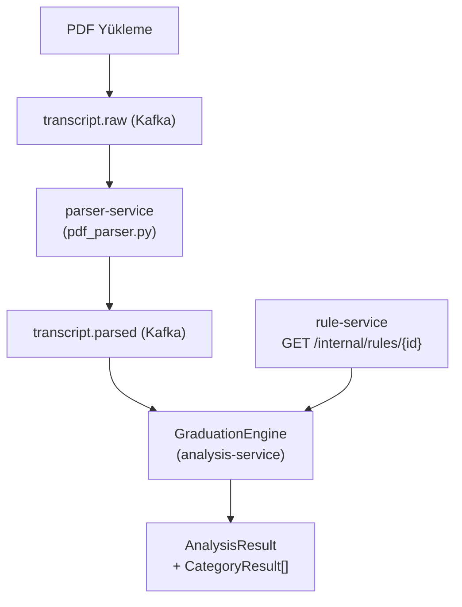
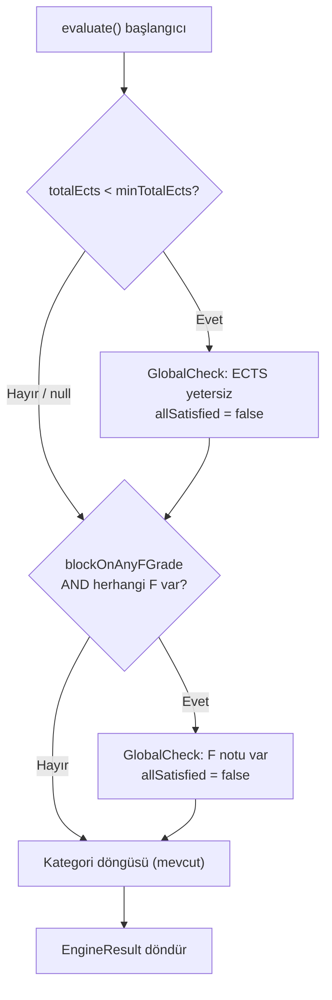
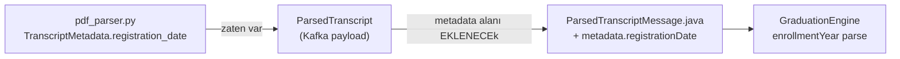
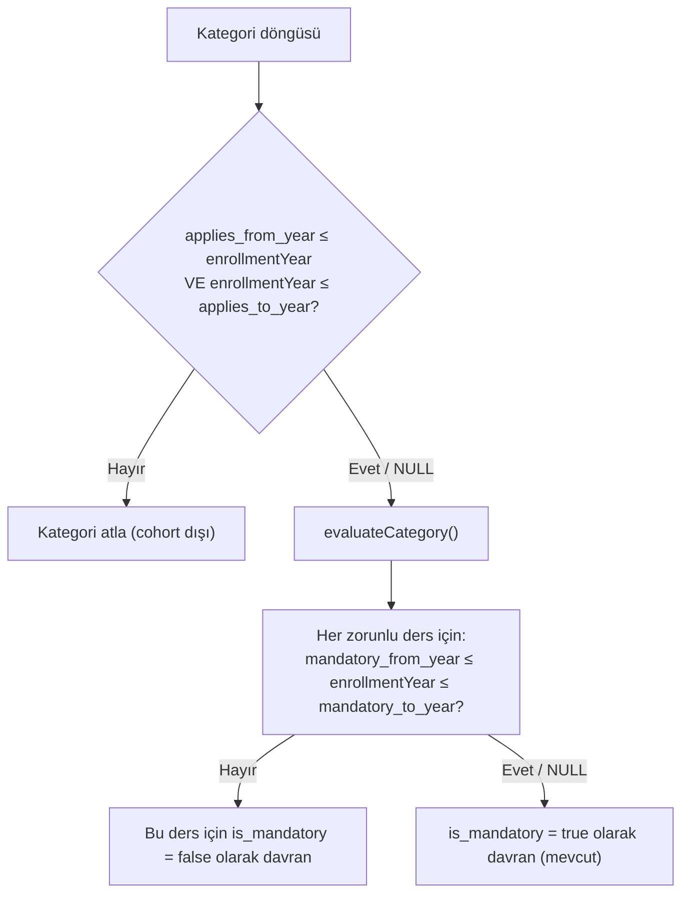
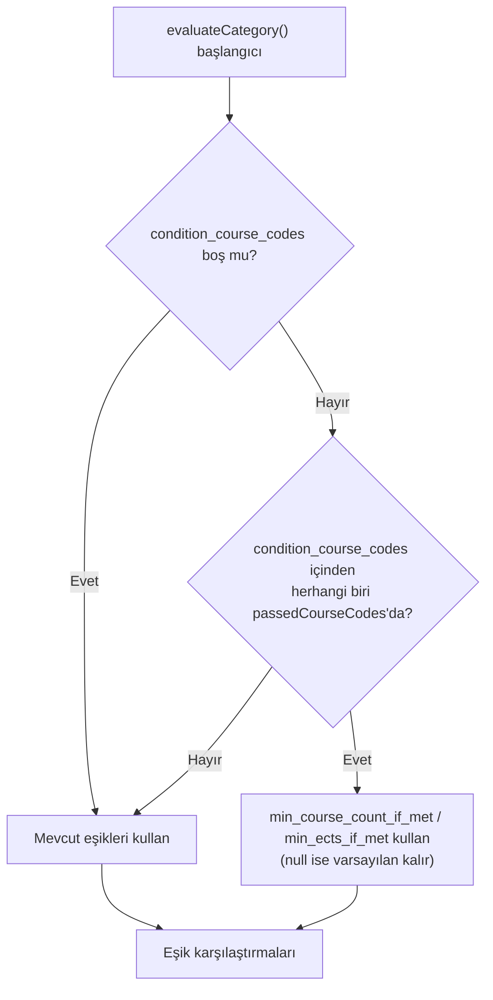
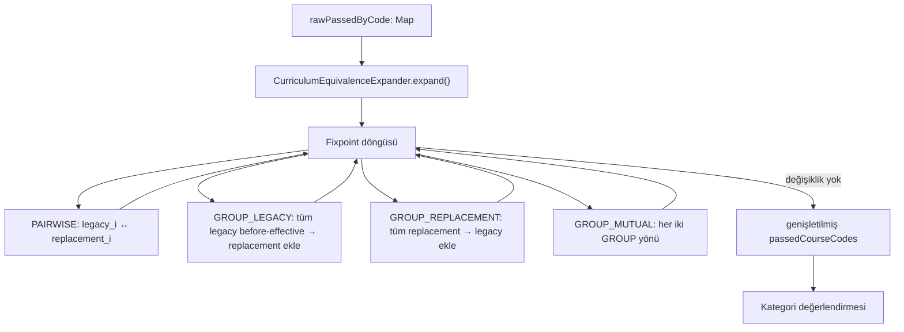
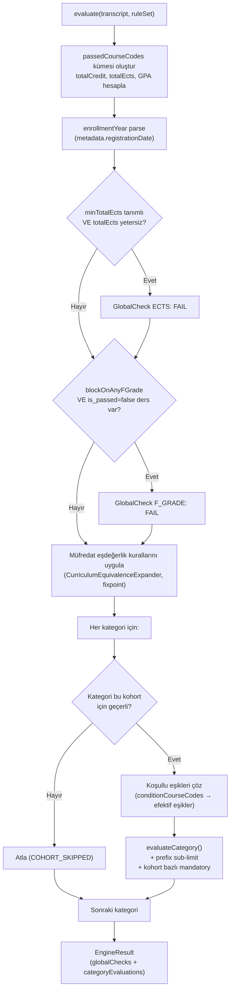

# TAMS — Mezuniyet Kuralları V2 Mimari

Bu belge, Bilgisayar Mühendisliği bölümünün gerçek mezuniyet koşullarını karşılamak için gerekli altyapı genişletmelerini açıklar. Uygulama adımları için → [`docs/graduation-rules-v2-refactor.md`](graduation-rules-v2-refactor.md)

---

## 1. Motivasyon

Mevcut sistem, bir bölüm için tanımlanan kategorilere sabit eşikler uygular. Hacettepe BBM mezuniyet koşulları ise üç ek boyut gerektirir:

| Boyut | Örnek |
|-------|-------|
| **Küresel / bölüm geneli kural** | En az 240 ECTS — kategorilerle bağımsız |
| **Kohort bazlı kural** | HAS/MUH 2015-2016 sonrasına zorunlu; BBM105 2017-2018 sonrasına zorunlu |
| **Koşullu eşik** | BBM384 geçilmişse 4 TS lab yeterli, geçilmemişse 5 gerekir |
| **Muafiyet** | FIZ103 + FIZ104 geçilmişse FIZ117'den muaf |
| **Prefix sub-limiti** | Bölüm dışı seçmelilerde en fazla 3 SEC kodlu ders sayılır |

---

## 2. Mevcut Sistemin Özeti



`GraduationEngine.evaluate()` şu anda:
1. Geçilen derslerin kümesini oluşturur (`passedCourseCodes`)
2. Her kategori için `evaluateCategory()` çağırır — `min_course_count`, `min_credit`, `min_ects`, `is_mandatory` kontrolü
3. Tüm kategoriler `satisfied` ise `isEligible = true`

---

## 3. Yeni Mimari: 6 Faz

### Faz 1 — Küresel Bölüm Kuralları

#### Neden yeni bir kavram?

240 ECTS şartı hiçbir kategoriye bağlı değildir; bölümün tamamına uygulanır. F notu engeli de benzer şekilde transkriptin tamamına bakılmasını gerektirir.

#### Veri Modeli Değişikliği — `departments`

```sql
ALTER TABLE departments
    ADD COLUMN min_total_ects      NUMERIC(6,2),          -- NULL = kontrol yok
    ADD COLUMN block_on_any_f_grade BOOLEAN NOT NULL DEFAULT FALSE;
```

#### Engine Davranışı



`GlobalCheckResult` — engine sonuç nesnesine eklenen yeni iç tip:

```
GlobalCheckResult(
    checkType: TOTAL_ECTS | FAIL_GRADE,
    passed: boolean,
    detail: String          -- "earned 180/240 ECTS" gibi
)
```

---

### Faz 2 — Enrollment Year / Cohort Akışı

#### Neden gerekli?

Kohort bazlı kuralların (Faz 3) çalışabilmesi için engine'in öğrencinin kayıt yılını bilmesi gerekir.

#### Mevcut Durum

`pdf_parser.py` içinde `registration_date` zaten regex ile çekiliyor (`_RE_REG_DATE`) ve `TranscriptMetadata.registration_date` alanına `"DD.MM.YYYY"` formatında atanıyor. Ancak `ParsedTranscriptMessage.java` (analysis-service Kafka consumer) şu an sadece `semesters` alanını taşıyor; `metadata` devre dışı.

#### Değişiklikler

**parser-service → analysis-service Kafka mesajı akışı:**



**`ParsedTranscriptMessage.java`** — `metadata` alanı eklenir:

```java
public record ParsedTranscriptMessage(
    String studentRef, String jobId, String teacherId, String departmentId,
    List<ParsedSemester> semesters,
    TranscriptMetadataDto metadata    // YENİ
) { ... }

public record TranscriptMetadataDto(
    String registrationDate   // "DD.MM.YYYY"
) {}
```

**analysis-service DB — `analysis_results` tablosu:**

```sql
ALTER TABLE analysis_results
    ADD COLUMN enrollment_year  INTEGER,
    ADD COLUMN enrollment_term  VARCHAR(10);   -- 'GUZ' veya 'BAHAR'
```

`enrollment_term` tespiti: `registration_date` ay bilgisinden türetilir — Ağustos (08) ve öncesi → `BAHAR`, Eylül (09) ve sonrası → `GUZ`.

---

### Faz 3 — Kohort Bazlı Kategori ve Zorunlu Ders Kuralları

#### Tasarım Kararı

Kohort filtresi iki düzeyde tanımlanır:

1. **Kategori düzeyi** (`applies_from_year` / `applies_to_year`): Kategori bütünüyle yalnızca belirli kohortlar için geçerlidir. Örnek: "HAS/MUH Zorunlu" kategorisi yalnızca 2015 ve sonrası.
2. **Zorunlu ders düzeyi** (`mandatory_from_year` / `mandatory_to_year`): Ders kategoride bulunmaya devam eder (isteğe bağlı seçmeli olarak sayılabilir), ama `is_mandatory` özelliği yalnızca belirli kohortlara uygulanır. Örnek: BBM384 kategoride her zaman var, ancak mandatory olma durumu 2017+ için geçerli.

#### Veri Modeli Değişiklikleri

**`categories` tablosu:**

```sql
ALTER TABLE categories
    ADD COLUMN applies_from_year  INTEGER,   -- NULL = tüm kohortlar
    ADD COLUMN applies_to_year    INTEGER;   -- NULL = üst sınır yok
```

**`category_courses` tablosu:**

```sql
ALTER TABLE category_courses
    ADD COLUMN mandatory_from_year  INTEGER,  -- NULL = her zaman zorunlu (mevcut davranış)
    ADD COLUMN mandatory_to_year    INTEGER;  -- NULL = üst sınır yok
```

#### BBM Yapılandırması Örneği

| Kategori | applies_from_year | applies_to_year |
|----------|-------------------|-----------------|
| HAS/MUH Zorunlu | 2015 | NULL |
| BBM105 Zorunlu | 2017 | NULL |
| Bölüm Zorunlu (FIZ103/104 dönemli) | NULL | 2016 |

| Ders | is_mandatory | mandatory_from_year | mandatory_to_year | Anlamı |
|------|-------------|--------------------|--------------------|--------|
| BBM384 | true | 2017 | NULL | 2017+ zorunlu, öncesi seçmeli lab |

#### Engine Davranışı



---

### Faz 4 — Koşullu Kategori Eşikleri

#### Motivasyon

- Teknik Seçmeli Lab kategorisi: BBM384 geçilmişse `min_course_count = 4`, geçilmemişse `min_course_count = 5`
- Bölüm Dışı Seçmeli kategorisi: HAS222, HAS223, MUH103 veya MUH104'ten herhangi biri geçilmişse `min_ects = 20`, hiçbiri geçilmemişse `min_ects = 22`

Her iki durum da aynı mekanizma ile çözülür: "koşul kurslarından herhangi biri geçilmişse daha düşük eşiği kullan."

#### Veri Modeli Değişikliği — `categories`

```sql
ALTER TABLE categories
    ADD COLUMN condition_course_codes  TEXT[]        DEFAULT '{}',
    ADD COLUMN min_course_count_if_met INTEGER,      -- NULL = değişiklik yok
    ADD COLUMN min_ects_if_met         NUMERIC(5,2); -- NULL = değişiklik yok
```

`condition_course_codes` içindeki kodlardan **herhangi biri** (`ANY` mantığı) öğrencinin geçilen dersleri arasındaysa koşul sağlanmış kabul edilir.

#### Engine Değişikliği — `evaluateCategory()`



---

### Faz 5 — Müfredat Değişikliği / Ders Eşdeğerliği Kuralları (Curriculum Equivalence Rules)

#### Motivasyon

Müfredat değişikliklerinde eski dersler yeni derslerle ikame edilir. Örneğin HAS222/HAS223 kaldırılmış ve MÜH103/MÜH104 eklenmiştir; BBM419 kaldırılmış, yerine BBM479+BBM480 gelmiştir; FİZ103+FİZ104 kaldırılmış, yerine FİZ117 eklenmiştir. Bu çok yönlü (bire bir, 1↔N, N→1) ilişkiler eski tek yönlü modeliyle temsil edilemiyordu.

#### Yeni Tablo — `curriculum_equivalence_rules`

```sql
CREATE TABLE curriculum_equivalence_rules (
    id                       UUID        PRIMARY KEY DEFAULT gen_random_uuid(),
    department_id            UUID        NOT NULL REFERENCES departments(id) ON DELETE CASCADE,
    rule_type                VARCHAR(30) NOT NULL,   -- PAIRWISE | GROUP_LEGACY_TO_REPLACEMENT | GROUP_REPLACEMENT_TO_LEGACY | GROUP_MUTUAL
    legacy_course_codes      TEXT[]      NOT NULL,   -- müfredattan çıkarılan dersler
    replacement_course_codes TEXT[]      NOT NULL,   -- müfredata eklenen dersler
    effective_from_year      INTEGER,                -- örn. 2019 (2019-2020 akademik yılı)
    effective_from_term      VARCHAR(10),            -- GUZ | BAHAR | NULL
    created_at               TIMESTAMPTZ NOT NULL DEFAULT NOW()
);
```

#### Kural Tipleri

| Tip | Örnek | Davranış |
|-----|-------|----------|
| `PAIRWISE` | HAS222↔MÜH103, HAS223↔MÜH104 | Her `legacy[i]` ↔ `replacement[i]` bire bir çift yönlü. Etkin tarih yok sayılır. |
| `GROUP_LEGACY_TO_REPLACEMENT` | FİZ103+FİZ104 → FİZ117 | Tüm eski dersler etkin tarihten önce geçildiyse tüm yeni dersler geçilmiş sayılır. |
| `GROUP_REPLACEMENT_TO_LEGACY` | BBM479+BBM480 → BBM419 | Tüm yeni dersler geçildiyse tüm eski dersler geçilmiş sayılır. |
| `GROUP_MUTUAL` | BBM419 ↔ BBM479+BBM480 | Her iki GROUP yönü birden uygulanır. |

#### `RuleSetResponse` Güncellemesi

```java
public record RuleSetResponse(
    UUID departmentId,
    String departmentName,
    BigDecimal minTotalEcts,
    boolean blockOnAnyFGrade,
    List<RuleCategoryDto> categories,
    List<CurriculumEquivalenceRuleDto> curriculumEquivalenceRules
) {}

public record CurriculumEquivalenceRuleDto(
    UUID id,
    String ruleType,
    List<String> legacyCourseCodes,
    List<String> replacementCourseCodes,
    Integer effectiveFromYear,
    String effectiveFromTerm
) {}
```

#### Engine Davranışı (CurriculumEquivalenceExpander)

Motor, `GraduationEngine.evaluate()` içinde kategori değerlendirmesinden önce `CurriculumEquivalenceExpander.expand()` çağırır. Bu metod, tüm kuralları değişiklik olmayıncaya kadar (fixpoint) tekrarlayarak uygular; zincirleme kurallar bu sayede doğru çalışır.



**Başarı Yılı (Başarı Yılı) kullanımı:** GROUP_LEGACY kurallarında `AcademicYearParser`, transkriptteki `"YY-YY"` formatını parse ederek ilgili dersin `effectiveFromYear/Term` sınırından önce alınıp alınmadığını kontrol eder. PAIRWISE kurallarında bu kontrol yapılmaz.

> Önemli: Genişletilmiş `passedCourseCodes` kümesi yalnızca kategori değerlendirmesinde kullanılır. `totalCredit`, `totalEcts` ve GPA her zaman ham transkript üzerinden hesaplanır.

---

### Faz 6 — Ders Kodu Prefix Sub-limit

#### Motivasyon

Bölüm dışı seçmeli kategorisinde öğrenciler en fazla 3 adet SEC kodlu ders sayabilir. Kategorideki `min_course_count` hâlâ toplam minimum sayıyı temsil eder; SEC prefix'i yalnızca **sayılabilecek üst sınırı** belirler.

#### Yeni Tablo — `category_prefix_limits`

```sql
CREATE TABLE category_prefix_limits (
    id                  UUID        PRIMARY KEY DEFAULT gen_random_uuid(),
    category_id         UUID        NOT NULL REFERENCES categories(id) ON DELETE CASCADE,
    course_code_prefix  VARCHAR(10) NOT NULL,
    max_count           INTEGER     NOT NULL,
    created_at          TIMESTAMPTZ NOT NULL DEFAULT NOW()
);

CREATE INDEX idx_category_prefix_limits_category_id ON category_prefix_limits (category_id);
```

#### `RuleCategoryDto` Güncellemesi

```java
public record RuleCategoryDto(
    UUID id, String name,
    BigDecimal minCredit, BigDecimal minEcts, int minCourseCount,
    // Faz 3:
    Integer appliesFromYear, Integer appliesToYear,
    // Faz 4:
    List<String> conditionCourseCodes,
    Integer minCourseCountIfMet, BigDecimal minEctsIfMet,
    // Faz 6:
    List<PrefixLimitDto> prefixLimits,   // YENİ
    List<RuleCourseDto> courses
) {}

public record PrefixLimitDto(String courseCodePrefix, int maxCount) {}
```

#### Engine Değişikliği — `evaluateCategory()`

`evaluateCategory()` içinde her ders işlenirken prefix sayaçları tutulur:

```
prefixCounters = Map<prefix, count>   // başta boş
...
for each poolCourse:
    if passed:
        prefix = prefixLimits için eşleşen prefix var mı?
        if var ve prefixCounters[prefix] >= maxCount:
            bu dersi say (earnedCredit/earnedEcts/earnedCount artırma)
            continue
        earnedCredit += ...
        earnedCount++
        if prefix eşleşmesi var: prefixCounters[prefix]++
```

---

## 4. Tam Veri Modeli Özeti

### rule-service (`tams_rules`)

```
departments
├── min_total_ects           NUMERIC(6,2)      [FAZ 1]
├── block_on_any_f_grade     BOOLEAN           [FAZ 1]
└── categories
      ├── applies_from_year  INTEGER           [FAZ 3]
      ├── applies_to_year    INTEGER           [FAZ 3]
      ├── condition_course_codes  TEXT[]        [FAZ 4]
      ├── min_course_count_if_met INTEGER       [FAZ 4]
      ├── min_ects_if_met    NUMERIC(5,2)      [FAZ 4]
      ├── category_courses
      │     ├── mandatory_from_year  INTEGER   [FAZ 3]
      │     └── mandatory_to_year   INTEGER    [FAZ 3]
      └── category_prefix_limits               [FAZ 6]
            ├── course_code_prefix  VARCHAR(10)
            └── max_count           INTEGER

curriculum_equivalence_rules                   [FAZ 5]
├── department_id            UUID FK
├── rule_type                VARCHAR(30) — PAIRWISE | GROUP_*
├── legacy_course_codes      TEXT[]
├── replacement_course_codes TEXT[]
├── effective_from_year      INTEGER (nullable)
└── effective_from_term      VARCHAR(10) GUZ | BAHAR (nullable)
```

### analysis-service (`tams_analysis`)

```
analysis_results
├── enrollment_year    INTEGER     [FAZ 2]
└── enrollment_term    VARCHAR(10) [FAZ 2]
```

---

## 5. Güncellenmiş Engine Akış Diyagramı (Tüm Fazlar)



---

## 6. Servisler Arası API Değişiklikleri

### `GET /internal/rules/{departmentId}` (rule-service → analysis-service)

**Yeni alanlar:**

```json
{
  "departmentId": "...",
  "departmentName": "Bilgisayar Mühendisliği",
  "minTotalEcts": 240.0,
  "blockOnAnyFGrade": true,
  "categories": [{
    "id": "...",
    "name": "Teknik Seçmeli Lab",
    "minCourseCount": 5,
    "appliesFromYear": null,
    "appliesToYear": null,
    "conditionCourseCodes": ["BBM384"],
    "minCourseCountIfMet": 4,
    "minEctsIfMet": null,
    "prefixLimits": [],
    "courses": [...]
  }],
  "curriculumEquivalenceRules": [{
    "id": "...",
    "ruleType": "GROUP_LEGACY_TO_REPLACEMENT",
    "legacyCourseCodes": ["FIZ103", "FIZ104"],
    "replacementCourseCodes": ["FIZ117"],
    "effectiveFromYear": 2017,
    "effectiveFromTerm": "GUZ"
  }]
}
```

### `transcript.parsed` Kafka Mesajı (parser-service → analysis-service)

**Yeni alan:**

```json
{
  "student_ref": "...",
  "job_id": "...",
  "teacher_id": "...",
  "department_id": "...",
  "semesters": [...],
  "metadata": {
    "registration_date": "15.09.2017"
  }
}
```

---

## 7. Tasarım Kararları ve Gerekçeler

| Karar | Alternatif | Gerekçe |
|-------|------------|---------|
| Koşullu eşikler kategoride tutuldu | Ayrı `conditional_rules` tablosu | Mevcut category CRUD API'si üzerinden yönetilebilir, ek endpoint gerekmez |
| Cohort: `applies_from_year` yıl olarak | Dönem string ("2015-GUZ") | Yıl karşılaştırması basit integer comparison; dönem sınırında (Güz/Bahar ayrımı) henüz gereksinim yok |
| Eşdeğerlik genişletmesi `passedCourseCodes` kopyasında | Transkripti değiştirme | Transkript immutable; engine sonuçlarında orijinal veriden sapma görünmez |
| Fixpoint döngüsü ile kural zinciri | Tek geçiş | Zincirleme kurallar (A→B, B→C) doğru çalışır; kural sayısı küçük (<20) olduğundan performans sorun değil |
| SEC sub-limit prefix tablosunda | Kategoride hardcode | Farklı bölümlerde farklı prefix kuralları olabilir; genel çözüm daha az teknik borç bırakır |
| `enrollment_term` `analysis_results`'ta | Hesaplanmayan | Tarihsel analiz ve debug için faydalı; her seferiden yeniden türetme gerekmez |

---

> Uygulama adımları için → [`docs/graduation-rules-v2-refactor.md`](graduation-rules-v2-refactor.md)
