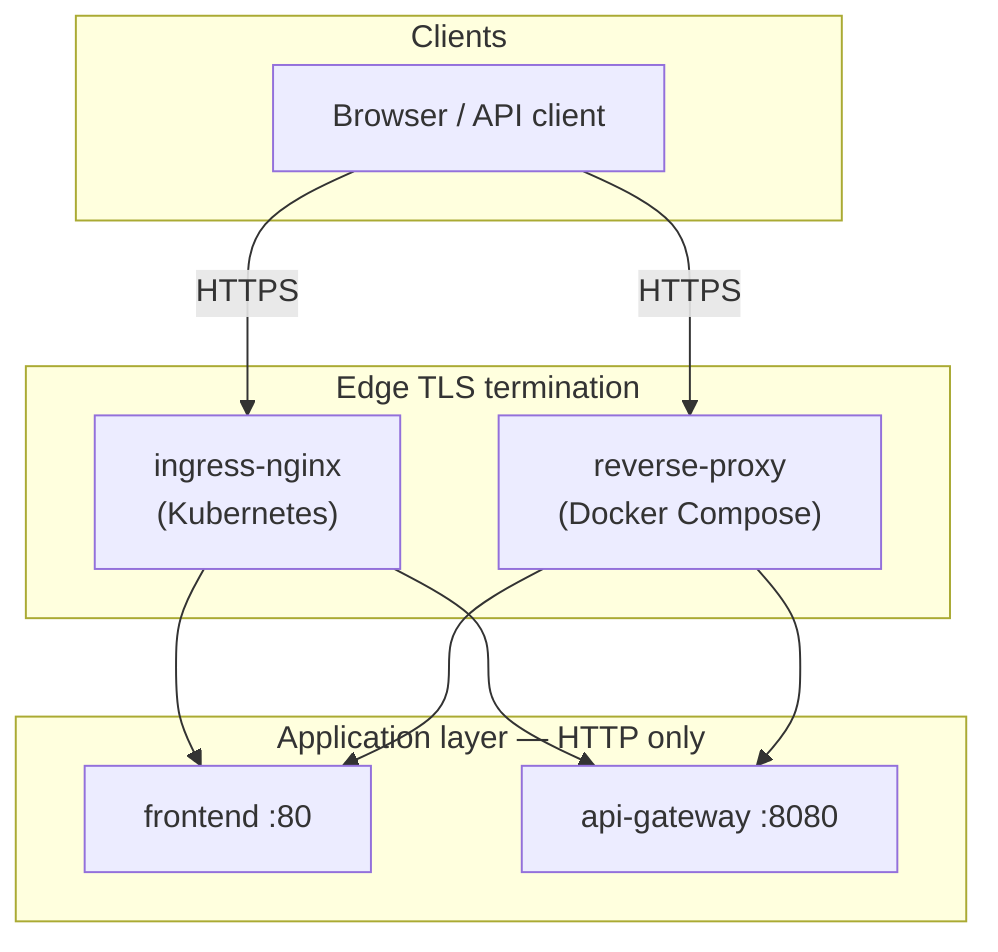

# TAMS — HTTPS Migration Guide

This document describes **when and how** to enable HTTPS for TAMS. Follow the steps in order.
TLS is terminated at the **edge layer only** (ingress-nginx in Kubernetes, reverse-proxy in
Docker Compose). Microservices inside the cluster continue to communicate over plain HTTP.

For the full production deployment workflow (registry, secrets, manifests), see
[production-deployment.md](./production-deployment.md).

---

## 1. Overview



**What changes when enabling HTTPS:**

| Component | HTTP (default local) | HTTPS |
|---|---|---|
| Browser entry URL | `http://localhost:5173` | `https://localhost` or `https://tams.hacettepe.edu.tr` |
| `VITE_API_URL` (frontend build) | `http://localhost:8080` | `https://<public-host>` (origin root, no `/api` suffix) |
| `CORS_ALLOWED_ORIGINS` (api-gateway) | `http://localhost:5173` | `https://<public-host>` |
| TLS certificates | Not required | Required at edge layer |

**What does not change:**

- Internal service URLs (`http://auth-service:8081`, etc.) stay HTTP inside the cluster/network.
- Spring Boot and FastAPI services do not need `server.ssl.*` configuration.

---

## 2. Prerequisites Checklist

Before starting, confirm:

- [ ] You know the public hostname (e.g. `tams.hacettepe.edu.tr` or `localhost` for local HTTPS).
- [ ] For Kubernetes: `kubectl` access to the target cluster.
- [ ] For Kubernetes: [ingress-nginx](https://kubernetes.github.io/ingress-nginx/) installed.
- [ ] For Kubernetes production: DNS `A` record pointing the hostname to the Ingress external IP.
- [ ] For Docker Compose HTTPS: [OpenSSL](https://www.openssl.org/) available on the host.
- [ ] You have decided which certificate source to use (see Section 3).

---

## 3. Choose a Certificate Source

| Scenario | Environment | Method | Tools |
|---|---|---|---|
| Local development / smoke test | Docker Compose | Self-signed | `generate-self-signed.sh` + `docker-compose.https.yml` |
| Local / dev Kubernetes cluster | Kubernetes | Self-signed (manual) | `generate-self-signed.sh` + `install-k8s-tls-secret.sh` |
| Local / dev Kubernetes cluster | Kubernetes | cert-manager self-signed issuer | `cluster-issuer-selfsigned.yaml` |
| Hacettepe institutional CA | Kubernetes | Manual import | `install-k8s-tls-secret.sh` |
| Public internet domain | Kubernetes | Let's Encrypt (automatic) | cert-manager + `cluster-issuer-prod.yaml` |

> **Production recommendation:** Use Hacettepe-provided certificates if the university IT team
> issues them for `*.hacettepe.edu.tr`. Use Let's Encrypt only when the domain is publicly
> reachable and HTTP-01 ACME challenges can reach the cluster.

---

## 4. Docker Compose — Enable HTTPS (Self-Signed)

Use this path for local HTTPS testing without Kubernetes.

### Step 4.1 — Generate a self-signed certificate

From the repository root:

```bash
TLS_DOMAIN=localhost ./infrastructure/tls/generate-self-signed.sh
```

This creates (git-ignored):

```
infrastructure/tls/generated/localhost/fullchain.pem
infrastructure/tls/generated/localhost/privkey.pem
```

### Step 4.2 — Configure environment variables

Add or update these values in your `.env` file (see `.env.example`):

```bash
TLS_DOMAIN=localhost
VITE_API_URL=https://localhost
CORS_ALLOWED_ORIGINS=https://localhost
```

### Step 4.3 — Start the stack with the HTTPS override

```bash
docker compose -f infrastructure/docker-compose.yml \
  -f infrastructure/docker-compose.https.yml up --build
```

The reverse-proxy listens on host ports **443** (HTTPS) and **80** (redirect to HTTPS).

### Step 4.4 — Verify Docker Compose HTTPS

```bash
# HTTP → HTTPS redirect
curl -k -I http://localhost
# Expected: HTTP/1.1 301  Location: https://localhost/...

# HTTPS health (via api-gateway through reverse proxy)
curl -k https://localhost/api/actuator/health
```

Open `https://localhost` in a browser. Accept the self-signed certificate warning.

---

## 5. Kubernetes — Common Steps (All Certificate Types)

These steps apply regardless of certificate source.

### Step 5.1 — Configure DNS

1. Install ingress-nginx and note the external IP:

   ```bash
   kubectl get svc -n ingress-nginx ingress-nginx-controller
   ```

2. Create a DNS `A` record:

   | Type | Name | Value |
   |---|---|---|
   | `A` | `tams.hacettepe.edu.tr` | `<EXTERNAL-IP>` |

3. Verify propagation:

   ```bash
   dig +short tams.hacettepe.edu.tr
   ```

### Step 5.2 — Update domain placeholders

Replace `tams.example.com` with your real domain:

```bash
grep -r "tams.example.com" infrastructure/k8s/

find infrastructure/k8s/ -type f -name "*.yaml" \
  -exec sed -i '' 's/tams\.example\.com/tams.hacettepe.edu.tr/g' {} +
```

Also update `CORS_ALLOWED_ORIGINS` in `infrastructure/k8s/tams-config.yaml`.

### Step 5.3 — Install ingress-nginx (if not already installed)

```bash
helm repo add ingress-nginx https://kubernetes.github.io/ingress-nginx
helm repo update
helm install ingress-nginx ingress-nginx/ingress-nginx \
  --namespace ingress-nginx --create-namespace \
  --set controller.replicaCount=2
```

### Step 5.4 — Deploy the application stack

Apply manifests in order (see [infrastructure/k8s/README.md](../infrastructure/k8s/README.md)).
Apply the Ingress **last**, after all backend services are healthy.

---

## 6. Kubernetes — Path A: Self-Signed Certificate (Manual)

Use for staging clusters or when Let's Encrypt is not available.

### Step 6A.1 — Generate certificate files

```bash
TLS_DOMAIN=tams.hacettepe.edu.tr ./infrastructure/tls/generate-self-signed.sh
```

### Step 6A.2 — Install the Kubernetes TLS secret

```bash
TLS_CERT_FILE=infrastructure/tls/generated/tams.hacettepe.edu.tr/fullchain.pem \
TLS_KEY_FILE=infrastructure/tls/generated/tams.hacettepe.edu.tr/privkey.pem \
  ./infrastructure/tls/install-k8s-tls-secret.sh
```

### Step 6A.3 — Configure Ingress for manual TLS

Remove the `cert-manager.io/cluster-issuer` annotation from
`infrastructure/k8s/api-gateway/ingress.yaml`. Use
`infrastructure/k8s/api-gateway/ingress-manual-tls.yaml.example` as reference.

Ensure `spec.ingressClassName: nginx` is set, then apply:

```bash
kubectl apply -f infrastructure/k8s/api-gateway/ingress.yaml
```

### Step 6A.4 — Verify

```bash
curl -k -I http://tams.hacettepe.edu.tr
curl -k https://tams.hacettepe.edu.tr/api/actuator/health
```

Browsers will show a security warning until a trusted CA certificate is installed.

---

## 7. Kubernetes — Path B: Hacettepe Institutional Certificate

Use when the university IT team provides `.crt` / `.key` files (or a PKCS#12 bundle to convert).

### Step 7B.1 — Prepare certificate files

You need:

- **Certificate chain** — server certificate plus any intermediate CA certificates, concatenated
  into a single PEM file (`fullchain.pem`).
- **Private key** — PEM-encoded private key (`privkey.pem`).

If IT provides separate files:

```bash
cat server.crt intermediate.crt > fullchain.pem
cp server.key privkey.pem
```

If IT provides a `.pfx` / `.p12` file:

```bash
openssl pkcs12 -in certificate.pfx -nocerts -out privkey.pem -nodes
openssl pkcs12 -in certificate.pfx -clcerts -nokeys -out server.crt
openssl pkcs12 -in certificate.pfx -cacerts -nokeys -out intermediate.crt
cat server.crt intermediate.crt > fullchain.pem
```

Store these files **outside the repository** or in the git-ignored `infrastructure/tls/generated/`
directory. Never commit private keys.

### Step 7B.2 — Install the TLS secret

```bash
TLS_CERT_FILE=/secure/path/fullchain.pem \
TLS_KEY_FILE=/secure/path/privkey.pem \
  ./infrastructure/tls/install-k8s-tls-secret.sh
```

### Step 7B.3 — Configure Ingress for manual TLS

Same as Step 6A.3: remove the cert-manager annotation, apply the Ingress manifest.

### Step 7B.4 — Update application configuration

1. Set `CORS_ALLOWED_ORIGINS` to `https://tams.hacettepe.edu.tr` in `tams-config.yaml`.
2. Rebuild and deploy the frontend with the HTTPS API URL:

   ```bash
   docker build -t ghcr.io/<org>/tams/frontend:<VERSION> \
     --build-arg VITE_API_URL=https://tams.hacettepe.edu.tr \
     -f frontend/Dockerfile frontend
   ```

3. Apply updated ConfigMap and frontend Deployment.

### Step 7B.5 — Verify

```bash
curl -I http://tams.hacettepe.edu.tr
# Expected: HTTP/1.1 301  Location: https://tams.hacettepe.edu.tr

curl https://tams.hacettepe.edu.tr/api/actuator/health
```

Open `https://tams.hacettepe.edu.tr` in a browser — no security warning if the CA is trusted.

---

## 8. Kubernetes — Path C: Let's Encrypt (cert-manager)

Use for publicly reachable domains when automatic certificate management is preferred.

### Step 8C.1 — Install cert-manager

```bash
./infrastructure/k8s/cert-manager/install.sh
```

### Step 8C.2 — Staging issuer first (avoid rate limits)

```bash
# Update email in cluster-issuer-staging.yaml, then:
kubectl apply -f infrastructure/k8s/cert-manager/cluster-issuer-staging.yaml

kubectl annotate ingress tams-ingress -n tams \
  cert-manager.io/cluster-issuer=letsencrypt-staging --overwrite

kubectl get certificate tams-tls -n tams -w
# Wait until READY=True
```

### Step 8C.3 — Switch to production issuer

```bash
kubectl apply -f infrastructure/k8s/cert-manager/cluster-issuer-prod.yaml

kubectl annotate ingress tams-ingress -n tams \
  cert-manager.io/cluster-issuer=letsencrypt-prod --overwrite

kubectl delete secret tams-tls -n tams

kubectl get certificate tams-tls -n tams -w
```

Keep the `cert-manager.io/cluster-issuer` annotation in `ingress.yaml` for this path.

### Step 8C.4 — Update application configuration

Same as Step 7B.4 (CORS + frontend rebuild with HTTPS `VITE_API_URL`).

### Step 8C.5 — Verify

```bash
curl -I http://tams.hacettepe.edu.tr
kubectl describe certificate tams-tls -n tams
```

Browser: lock icon shows issuer **Let's Encrypt**, no warnings.

---

## 9. Certificate Renewal

| Certificate source | Renewal process |
|---|---|
| Let's Encrypt (cert-manager) | **Automatic** — cert-manager renews 30 days before expiry. No action required. |
| Hacettepe institutional | **Manual** — when IT provides new files, run `renew-manual-cert.sh`. |
| Self-signed | **Manual** — regenerate with `generate-self-signed.sh`, then `renew-manual-cert.sh`. |

Manual renewal:

```bash
TLS_CERT_FILE=/path/to/new-fullchain.pem \
TLS_KEY_FILE=/path/to/new-privkey.pem \
  ./infrastructure/tls/renew-manual-cert.sh
```

ingress-nginx reloads the secret automatically; no pod restart is required.

Verify next renewal (Let's Encrypt):

```bash
kubectl describe certificate tams-tls -n tams | grep -A5 "Renewal Time"
```

---

## 10. Troubleshooting

| Symptom | Likely cause | Fix |
|---|---|---|
| `CertificateRequest` stuck in `Pending` | HTTP-01 challenge unreachable | Ensure DNS points to Ingress IP; port 80 open |
| Browser shows wrong certificate | Old secret cached | `kubectl delete secret tams-tls -n tams`; re-apply cert path |
| cert-manager overwrites manual cert | Issuer annotation still present | Remove `cert-manager.io/cluster-issuer` from Ingress |
| CORS errors after HTTPS | Origin mismatch | Set `CORS_ALLOWED_ORIGINS` to exact `https://` origin |
| Frontend calls HTTP API | Stale frontend image | Rebuild with `--build-arg VITE_API_URL=https://...` |
| `502 Bad Gateway` on `/api` | api-gateway not ready | `kubectl get pods -n tams`; check api-gateway logs |
| Self-signed warning in browser | Expected for self-signed | Accept warning (dev) or use institutional/LE cert |
| Compose reverse-proxy fails to start | Missing cert files | Run `generate-self-signed.sh` first |
| `ingressClassName` not found | ingress-nginx not installed | Install ingress-nginx; verify with `kubectl get ingressclass` |

---

## 11. Reference Files

| File | Purpose |
|---|---|
| [infrastructure/tls/generate-self-signed.sh](../infrastructure/tls/generate-self-signed.sh) | Generate self-signed PEM files |
| [infrastructure/tls/install-k8s-tls-secret.sh](../infrastructure/tls/install-k8s-tls-secret.sh) | Create `tams-tls` Kubernetes secret |
| [infrastructure/tls/renew-manual-cert.sh](../infrastructure/tls/renew-manual-cert.sh) | Replace manual secret on renewal |
| [infrastructure/docker-compose.https.yml](../infrastructure/docker-compose.https.yml) | Docker Compose HTTPS override |
| [infrastructure/reverse-proxy/](../infrastructure/reverse-proxy/) | Edge reverse proxy for Compose |
| [infrastructure/k8s/api-gateway/ingress.yaml](../infrastructure/k8s/api-gateway/ingress.yaml) | Production Ingress (Let's Encrypt) |
| [infrastructure/k8s/api-gateway/ingress-manual-tls.yaml.example](../infrastructure/k8s/api-gateway/ingress-manual-tls.yaml.example) | Ingress template for manual certs |
| [infrastructure/k8s/cert-manager/](../infrastructure/k8s/cert-manager/) | cert-manager issuers and install script |
| [production-deployment.md](./production-deployment.md) | Full production deployment guide |

---

## 12. Future Improvements (Out of Scope)

The following are documented in [architecture.md](./architecture.md) but not yet implemented:

- PostgreSQL `sslmode=require` for database connections
- Kafka TLS encryption between brokers and clients
- Service mesh mTLS for inter-service communication

These can be added in a later phase without changing the edge TLS design described here.
